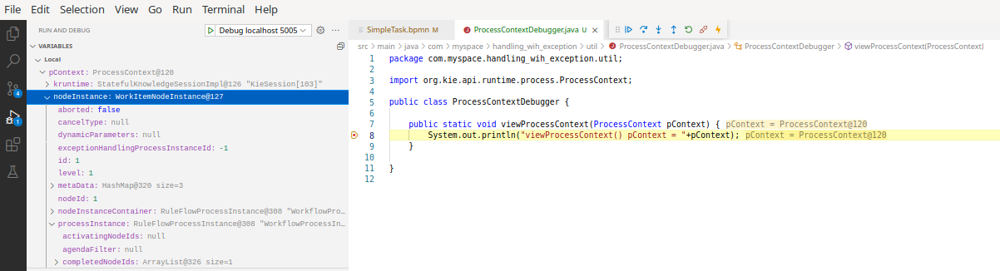

:scrollbar:
:data-uri:
:toc2:
:linkattrs:

== Purpose

:numbered:

Demonstrate execution of business processes and rules in a containerized RH-PAM KieServer environment.

== Design criteria:

. Lightweight kie-server runtime based on Red Hat supported Spring Boot
. Kie-server enabled (and exposes RESTful APIs) for both business rules and business processes
. Kie-server API is documented via swagger
. Kie-server is built as a linux container image and is immutable
+
Changes / updates to the linux container are done through a Dockerfile and conventional tooling such as docker or podman.

. Kie-server is "unmanaged"
+
Deployments of _kie-containers_ to the Kie-server are not done via a _kie-controller_ (ie:  Business Central or Business Central Monitoring)
+
Instead, the _kie-container_ jar file is built into the linux container image and referenced in an XML based _kie-controller_ configuration file (also baked into the linux container image)

. Kie-server along with Task lifecycle management is secured using RH-SSO  (in particular:  OpenID Connect)

. Expose a custom API that is capabile of starting a synchroneous business process (with no wait states) and returning the modified process variables to the invoking client

== Overview
There are several sub-projects included.

. *mortgages*
+
Simple KJar example with business rules.
Plagarized from:  https://github.com/kiegroup/kie-wb-playground/tree/master/mortgages

. *bpmn-examples*
+
Simple KJar example with various business processes and WorkItemHandlers that help to highlight the following: 

.. exception handling sample
+
Provides examples of exception handling in a business process using the various strategies of RH-PAM's ProcessWorkItemHandlerException functionality

... *DealWithExceptionViaHT*
... *DealWithExceptionViaTimer*
... *BoundaryEventExceptionHandling*

.. *Simple Signal*

.. *Executor Sample*

.. *Simple Task*
+
Business process with a simple human task.  Used to demonstrate SSO enabled _UserGroupCallback_.

. *rhpam-springboot*
+
This project provides a RH-PAM KieServer embedded in SpringBoot.
It includes a pre-configured _KIE Container_ that manages the _mortgages_ and _bpmn-examples_ KIE jars.
+
The resultant _Kie Container_  is then packaged into an immutable Linux container.

== Local Containerized Environment

This project includes a _docker-compose_ config file that allows for deployment of the application as containers in your local environment.

. Start application pod with all linux containers:
+
-----
$ docker-compose -f etc/docker-compose.yaml up -d
-----
+
NOTE:  If underlying linux container system in use in your local environment is podman, then follow this link:https://fedoramagazine.org/use-docker-compose-with-podman-to-orchestrate-containers-on-fedora/[set-up guide].

. Log into _master_ realm of RH-SSO

.. Disable SSL requirement for master realm:
+
-----
$ podman exec -it etc_psql_sso_1 psql sso -c "update REALM set ssl_required='NONE' where id = 'master'"
-----

.. Log into _master_ realm of RH-SSO at http://localhost:4080 using credentials of:  master / master

. Log into _kieRealm_ at http://localhost:4080/auth/admin/kieRealm/console using credentials of:  ssoRealmAdmin / pam

. Stop application pod with all linux containers:
+
-----
$ docker-compose -f etc/docker-compose.yaml down
-----

== Test

. Set the following environment variables with values similar to the following:
+
-----
rhsso_hostname=localhost:4080
kieserver_hostname=localhost:9080
retrieve_token_url="http://$rhsso_hostname/auth/realms/kieRealm/protocol/openid-connect/token"
-----

. Retrieve an OAuth2 token using the `kie-server` SSO client of `kieRealm`:
+
-----
TKN=$(curl -X POST "$retrieve_token_url" \
            -H "Content-Type: application/x-www-form-urlencoded" \
            -d "username=pamAdmin" \
            -d "password=pam" \
            -d "grant_type=password" \
            -d "client_id=kie-server" \
            | sed 's/.*access_token":"//g' | sed 's/".*//g')

echo $TKN

eyJhbGciOiJSUzI1NiIsInR5cCIgOiAiSldUIiwia2lkIiA6ICJOd010SUpfRnFuY3BMODJSQWRJMkMxSklLcXJWUzlBRWVNSHM0RktRZi1BIn0.eyJleHAiOjE2MTA3NjEzMzUsImlhdCI6MTYxMDc2MTAzNSwianRpIjoiOGM1YzJlZTAtMmZmZi00MGFhLTg0MGYtZWE2N2MxYWViNWZjIiwiaXNzIjoiaHR0cHM6Ly9rZXljbG9hay1yaC1zc28uYXBwcy5yaHRuY2twbWcucmhzbGVkb2NwLmNvbS9hdXRoL3JlYWxtcy9raWVSZWFsbSIsImF1ZCI6ImFjY291bnQiLCJzdWIiOiIzMmE4NjczNi04MThiLTRiM2MtODQyZi0zY2U4OGU3MjJkZGMiLCJ0eXAiOiJCZWFyZXIiLCJhenAiOiJraWUtc2VydmVyIiwic2Vzc2lvbl9zdGF0ZSI6Ijk0M2Y3NzRhLTgyOTItNDg1Mi04MmZkLWY2ZGNiMGU0NzQ0YiIsImFjciI6IjEiLCJhbGxvd2VkLW9yaWdpbnMiOlsiaHR0cHM6Ly9yaHBhbS1raWVzZXJ2ZXItcmhwYW0tZGV2LW9uY29yZS5hcHBzLnJodG5ja3BtZy5yaHNsZWRvY3AuY29tOjQ0MyIsImh0dHBzOi8vcmhwYW0ta2llc2VydmVyLXJocGFtLWRldi1vbmNvcmUuYXBwcy5yaHRuY2twbWcucmhzbGVkb2NwLmNvbSJdLCJyZWFsbV9hY2Nlc3MiOnsicm9sZXMiOlsia2llbWdtdCIsImFkbWluIiwicmVzdC1hbGwiLCJBZG1pbmlzdHJhdG9ycyIsImtpZS1zZXJ2ZXIiLCJ1c2VyIl19LCJyZXNvdXJjZV9hY2Nlc3MiOnsiYWNjb3VudCI6eyJyb2xlcyI6WyJtYW5hZ2UtYWNjb3VudCIsIm1hbmFnZS1hY2NvdW50LWxpbmtzIiwidmlldy1wcm9maWxlIl19fSwic2NvcGUiOiJwcm9maWxlIGVtYWlsIiwiZW1haWxfdmVyaWZpZWQiOmZhbHNlLCJwcmVmZXJyZWRfdXNlcm5hbWUiOiJwYW1hZG1pbiIsImVtYWlsIjoicGFtYWRtaW5Ab3BlbnNoaWZ0Lm9wZW50bGMuY29tIn0.bmHT1R25G13c4CdYK2am-5-a-Y1QwRequsXg2C55fj7kdfBr8yJ7_qRrGQxQ4spy28f3O0vdtMc10O3h3HFTPZoCaGVqfciE4axcZI2zZLdVmc6qlmfLIj-hjZMqoOB-tAYyHcFoUN9mtQmJWhCaFO0JysCUpQHeOjssSizjjRHLW5Dsg5JHqZxR4iBuG-KBlfK-cI0ryeNQV5ljdP6nNn7UrEbhHP_rFyZlmHXgOAraL6MC75Rnra0nwIvg4Wu30WXppxT7HUlQj1lFBaZQUzmFXXJBXHBq_5ofNHgervMFtmyzlG_3r892e4JS1qZ7o4fDaXyMvD1RTa6WwKpC8g
-----

. By setting _fullScopeAllowed=true_ in SSO client, all roles assocated with an authenticated user will be included in the access token.
+
These roles can be visualized as follows:
+
-----
$ jq -R 'split(".") | .[1] | @base64d | fromjson' <<< $TKN | jq .realm_access.roles

[
  "interviewer",
  "kie-server",
  "user"
]
-----

. Using the OAuth2 token, invoke the kie-server to determine its current status:
+
-----
$ curl -v \
    -H "Authorization: Bearer $TKN" \
    -X GET \
    -H 'Accept:application/json' \
    $kieserver_hostname/rest/server
-----

. Check CORS headers using a _preflight_ request:
+
-----
$ curl -i -X OPTIONS -H "Origin: http://localhost:8080" \
    -H 'Access-Control-Request-Method: POST' \
    -H 'Access-Control-Request-Headers: Content-Type, Authorization' \
    "$retrieve_token_url"

HTTP/1.1 200 
Vary: Origin
Vary: Access-Control-Request-Method
Vary: Access-Control-Request-Headers
Access-Control-Allow-Origin: http://localhost:7080
Access-Control-Allow-Methods: GET,HEAD,POST,DELETE,PUT,OPTIONS
Access-Control-Allow-Headers: Content-Type, Authorization
Access-Control-Allow-Credentials: true
Access-Control-Max-Age: 1800
X-Frame-Options: DENY
-----

. Health Check Report
+
-----
$ curl -H "Authorization: Bearer $TKN" -H 'Accept:application/json' $kieserver_hostname/rest/server/healthcheck?report=true
-----

. View swagger
+
-----
$ curl -v -H "Authorization: Bearer $TKN" $kieserver_hostname/rest/swagger.json | jq .
-----

. View Swagger UI
+
Point your browser to the output of the following:
+
-----
$ echo -en "\n$kieserver_hostname/rest/api-docs?url=http://$kieserver_hostname/rest/swagger.json\n"
-----

. List KIE Containers
+
-----
$ curl -H "Authorization: Bearer $TKN" -X GET $kieserver_hostname/rest/server/containers
-----

. List process definitions in JSON representation:
+
-----
$ curl -H "Authorization: Bearer $TKN" -X GET -H 'Accept:application/json' $kieserver_hostname/rest/server/containers/bpmn-examples/processes/
-----

=== Simple Data Object

. Start business process instance with a data object:
+
-----
$ curl -v -X POST -H 'Content-type:application/json' \
        -H "Authorization: Bearer $TKN" \
        $kieserver_hostname/rest/server/containers/bpmn-examples/processes/SimpleDataObject/instances \
        -d '{"DataObject1" : "DO1", "processVariable1" : "PV1"}'
-----

=== Simple Task

. Start business process instance with human task:
+
-----
$ curl -v -X POST -H 'Content-type:application/json' \
        -H "Authorization: Bearer $TKN" \
        $kieserver_hostname/rest/server/containers/bpmn-examples/processes/SimpleTask/instances
-----

. View list of tasks as a Business Administrator
+
-----
$ curl -v -X GET -H 'Content-type:application/json' \
        -H "Authorization: Bearer $TKN" \
        $kieserver_hostname/rest/server/queries/tasks/instances/admins
-----

. Grab a JWT specific to the _eve_ user and query for human tasks:
+
-----
TKN=$(curl -X POST "$retrieve_token_url" \
            -H "Content-Type: application/x-www-form-urlencoded" \
            -d "username=eve" \
            -d "password=pam" \
            -d "grant_type=password" \
            -d "client_id=kie-server" \
            | sed 's/.*access_token":"//g' | sed 's/".*//g')

$ curl -v -X GET -H 'Content-type:application/json' \
        -H "Authorization: Bearer $TKN" \
        $kieserver_hostname/rest/server/queries/tasks/instances/pot-owners
-----

=== Dynamic Assignment
The purpose of this example is to showcase some of the functionality enabled by link:https://github.com/kiegroup/jbpm/blob/main/jbpm-human-task/jbpm-human-task-workitems/src/main/java/org/jbpm/services/task/wih/util/PeopleAssignmentHelper.java[org.jbpm.services.task.wih.util.PeopleAssignmentHelper]

NOTE:  This known link:https://issues.redhat.com/browse/KOGITO-6283[issue] with the authoring tooling affects this example.

. As a business administrator, start a business process with user tasks using a payload that specifies the desired user and group assignments of those tasks:
+
-----
$ curl -v -X POST -H 'Content-type:application/json' \
        -H "Authorization: Bearer $TKN" \
        $kieserver_hostname/rest/server/containers/bpmn-examples/processes/DynamicAssignment/instances \
        -d '{"ActorId" : "eve", "GroupId" : "talent-acquisition"}'
-----

. View list of tasks as a Business Administrator:
+
-----
$ curl -v -X GET -H 'Content-type:application/json' \
        -H "Authorization: Bearer $TKN" \
        $kieserver_hostname/rest/server/queries/tasks/instances/admins
-----

. Grab the taskId of the task dynamically assigned to _eve_:
+
-----
$ TASKID=$(curl -v -X GET -H 'Content-type:application/json' \
        -H "Authorization: Bearer $TKN" \
        $kieserver_hostname/rest/server/queries/tasks/instances/admins \
        | jq '."task-summary"[0]."task-id"')

$ echo $TASKID
-----

. Grab a JWT specific to the _eve_ user and start the user task (currently in a Reserved status) :
+
-----
TKN=$(curl -X POST "$retrieve_token_url" \
            -H "Content-Type: application/x-www-form-urlencoded" \
            -d "username=eve" \
            -d "password=pam" \
            -d "grant_type=password" \
            -d "client_id=kie-server" \
            | sed 's/.*access_token":"//g' | sed 's/".*//g')

$ curl -v -X PUT -H 'Content-type:application/json' \
        -H "Authorization: Bearer $TKN" \
        $kieserver_hostname/rest/server/containers/bpmn-examples/tasks/$TASKID/states/started
-----

. Complete the human task as the _eve_ user:
+
-----
$ curl -v -X PUT -H 'Content-type:application/json' \
        -H "Authorization: Bearer $TKN" \
        $kieserver_hostname/rest/server/containers/bpmn-examples/tasks/$TASKID/states/completed
-----

. Grab a JWT specific to the _tina_ user (with a role of talent-acquisition) and claim the next user task (currently in a Ready status) defined in the business process:
+
-----
TKN=$(curl -X POST "$retrieve_token_url" \
            -H "Content-Type: application/x-www-form-urlencoded" \
            -d "username=tina" \
            -d "password=pam" \
            -d "grant_type=password" \
            -d "client_id=kie-server" \
            | sed 's/.*access_token":"//g' | sed 's/".*//g')
-----

. View the tasks that have been dynamically assigned to the group that the _tina_ user belongs to:
+
-----
$ curl -v -X GET -H 'Content-type:application/json' \
        -H "Authorization: Bearer $TKN" \
        $kieserver_hostname/rest/server/queries/tasks/instances/pot-owners
-----

. Grab the taskId of the task:
+
-----
$ TASKID=$(curl -v -X GET -H 'Content-type:application/json' \
        -H "Authorization: Bearer $TKN" \
        $kieserver_hostname/rest/server/queries/tasks/instances/pot-owners \
        | jq '."task-summary"[0]."task-id"')

$ echo $TASKID

-----

. Execute task lifecycle:
+
-----
$ curl -v -X PUT -H 'Content-type:application/json' \
        -H "Authorization: Bearer $TKN" \
        $kieserver_hostname/rest/server/containers/bpmn-examples/tasks/$TASKID/states/claimed

$ curl -v -X PUT -H 'Content-type:application/json' \
        -H "Authorization: Bearer $TKN" \
        $kieserver_hostname/rest/server/containers/bpmn-examples/tasks/$TASKID/states/started

$ curl -v -X PUT -H 'Content-type:application/json' \
        -H "Authorization: Bearer $TKN" \
        $kieserver_hostname/rest/server/containers/bpmn-examples/tasks/$TASKID/states/completed
-----

=== Process Debugger
In an ideal world, it would be nice if there was a visual tool to place a breakpoint anywhere on a BPMN diagram so as to debug a corresponding process instance.

Such a tool does not exist.  However, it's not very difficult to come close to that objective using an easy approach illustrated here.

This quickstart introduces a simple class called:  _com.myspace.handling_wih_exception.util.ProcessContextDebugger_ .

Thas class is invoked in the _onEntry_ action of a service task and passed to it the KIE _org.kie.api.runtime.process.ProcessContext_.  A breakpoint is placed on a function of this class. 

. Start RH-PAM in remote debug mode (where JVM suspends and listens on port 5005):
+
-----
$  export JAVA_OPTS="-agentlib:jdwp=transport=dt_socket,address=*:5005,server=y,suspend=y"
$ java $JAVA_OPTS -Dorg.kie.server.repo=../etc/rhpam/runtime_configs               -jar target/rhpam-springboot-0.0.1.jar
-----

. Using your vscode IDE, configure it to start a debugger session that invokes the remote RH-PAM springboot app on port 5005.

. As a business administrator, start an instance of _TaskBreakPoint_ process:
+
-----
$ curl -v -X POST -H 'Content-type:application/json' \
        -H "Authorization: Bearer $TKN" \
        $kieserver_hostname/rest/server/containers/bpmn-examples/processes/TaskBreakPoint/instances
-----

. Inspect the ProcessContext at the breakpoint:
+

=== WIH Exceptions

. Start a business process that throws a ProcessWIHException that delegates to a subprocess with human task
+
-----
$ pInstanceId=$( curl -v -X POST -H 'Content-type:application/json' \
        -H "Authorization: Bearer $TKN" \
        $kieserver_hostname/rest/server/containers/bpmn-examples/processes/handling_wih_exception.MainProcess/instances \
        -d "{\"input\":\"HT\"}" \
  ) 

$ TO-DO:   get subprocess based on parent process

$ curl -X GET -H "Authorization: Bearer $TKN" \
              -H 'Accpet:application/json' \
              $kieserver_hostname/rest/server/queries/tasks/instances/process/$pInstanceId
-----

. Start and Signal ExecutorSample business process
+
-----
# select status, commandname, deploymentid, executions, message, processinstanceid, timestamp from requestinfo;

$ curl -v -X POST -H 'Content-type:application/json' \
          -H "Authorization: Bearer $TKN" \
          $kieserver_hostname/rest/server/containers/bpmn-examples/processes/ExecutorSample/instances

$ curl -v -X POST -H 'Content-type:application/json' \
          -H "Authorization: Bearer $TKN" \
          $kieserver_hostname/rest/server/containers/bpmn-examples/processes/SimpleSignal/instances

$ curl -v -X GET \
          -H "Authorization: Bearer $TKN" \
          $kieserver_hostname/rest/server/containers/bpmn-examples/processes/instances/1/signals

$ curl -v -X POST -H 'Content-type:application/json' \
          -H "Authorization: Bearer $TKN" \
          $kieserver_hostname/rest/server/containers/bpmn-examples/processes/instances/1/signal/testSignal
-----

. Start a business process that throws a ProcessWIHException that retries a subprocess with timer 
+
-----
$ curl -v -X POST -H 'Content-type:application/json' \
        -H "Authorization: Bearer $TKN" \
        $kieserver_hostname/rest/server/containers/bpmn-examples/processes/handling_wih_exception.MainProcess/instances \
        -d "{\"input\":\"TIMER\"}"
-----

. Start a business process that throws a WorkItemHandlerRuntimeException that is caught by an Intermediary Catch Event
+
-----
$ curl -v -X POST -H 'Content-type:application/json' \
        -H "Authorization: Bearer $TKN" \
        $kieserver_hostname/rest/server/containers/bpmn-examples/processes/handling_wih_exception.BoundaryEventExceptionHandling/instances

-----

. Start a business process and return process variables:
+
-----
$ curl -H "Authorization: Bearer $TKN" \ 
       -X POST "$kieserver_hostname/custom/processes/startAndReturnVars?correlationKey=rht&input=HT" | jq .
-----

. Test Drools API

.. Create a request payload that will be used when firing rules of the Mortgage sample application:
+
-----
$ echo '
{
  "commands": [
      { "insert": {
        "object": {
          "mortgages.mortgages.Applicant": {
            "name": "sarah",
            "age": 25,
            "creditRating": 650
          }
        },
        "out-identifier": "applicant_sarah",
        "return-object": true
      }},
      { "insert": {
        "object": {
          "mortgages.mortgages.LoanApplication": {
            "amount": 2500
          }
        },
        "out-identifier": "loanapp",
        "return-object": true
      }},
      { "insert": {
        "object": {
          "mortgages.mortgages.IncomeSource": {
            "amount": "50"
          }
        },
        "out-identifier": "incomesource",
        "return-object": true
      }},
      { "insert": {
        "object": {
          "mortgages.mortgages.Bankruptcy": {
            "yearOfOccurence": "1991",
            "amountOwed": "11000"
          }
        },
        "out-identifier": "bankruptcy",
        "return-object": true
      }},
    {
      "fire-all-rules": {
        "max": 10,
        "out-identifier": "firedActivations"
      }
    }
  ]
}

' > /tmp/mortgage_rules_execution.json
-----

.. Invoke kie-server with payload to insert facts and fire all rules of the Mortgage application:
+
-----
curl -v \
    -H  "accept: application/json" \
    -H  "content-type: application/json" \
    -X POST http://$kieserver_hostname/rest/server/containers/instances/mortgages-0.0.1 \
    -d @/tmp/mortgage_rules_execution.json
-----

.. The response should include a JSON element that indicates that the loan application has been declined due to a prior bankruptcy:
+
-----
{
  "type" : "SUCCESS",
  "msg" : "Container mortgages_1.0.0 successfully called.",
  "result" : {
    "execution-results" : {
      "results" : [ {
        "value" : {"mortgages.mortgages.LoanApplication":{
  "amount" : 2500,
  "approved" : false,
  "approvedRate" : null,
  "deposit" : null,
  "explanation" : "has been bankrupt",
  "insuranceCost" : null,
  "lengthYears" : null
}}
-----

podman exec -it etc_dbuilder_runtime_1 /bin/sh

./wildfly/bin/jboss-cli.sh --connect --controller=localhost:10190
    /subsystem=logging/root-logger=ROOT:write-attribute(name=level, value=DEBUG)
    /subsystem=logging/console-handler=CONSOLE:write-attribute(name=level, value=DEBUG)

== Development

. Build and start SpringBoot based KIE-Server app :
+
-----
$ mvn clean package -DskipTests && \
         java -Dorg.kie.server.repo=../etc/rhpam/runtime_configs \
              -jar target/rhpam-springboot-0.0.1.jar  &> /tmp/rhpam.log &
-----

== Reference

. SSO Themes

.. https://robferguson.org/blog/2020/04/12/keycloak-themes-part-1/
.. https://www.keycloak.org/docs/latest/server_development/#default-themes

. link:https://github.com/kiegroup/jbpm/tree/7.48.0.Final/jbpm-db-scripts/src/main/resources/db/ddl-scripts/postgresql[RH-PAM / PostgreSQL Schemas]
+
The sql files contained in this project where copied from this git repository.

. link:https://github.com/jboss-container-images/rhpam-7-openshift-image/tree/master/templates[OpenShift templates for traditional Business Central and KIE-Server]
+
Traditional Business Central and KIE-Server run on JBoss EAP 7.
+
These OpenShift templates are used when deploying traditional KIE-Server and Business Central to OpenShift.
+
These templates reference RH-PAM images found in registry.redhat.io.
+
For the purpose of this project, these templates nor RH-PAM container images are not used.

. link:https://mswiderski.blogspot.com/2018/10/handle-service-exceptions-via-subprocess.html[Handle Service Exceptions via Subprocess]

